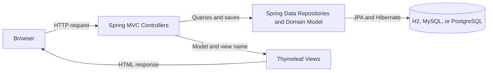

# Spring PetClinic Architecture Exploration - 2026-09

## Scope

**Repository:** Spring PetClinic  
**Exploration mode:** Claude Code Plan mode  
**Application code modified:** No

The goal was to map the main architecture, trace one owner-search flow, investigate one error path, and identify a genuine piece of technical debt.

## Application entry point

The application starts in:

`src/main/java/org/springframework/samples/petclinic/PetClinicApplication.java`

The `PetClinicApplication` class uses `@SpringBootApplication`, which enables Spring Boot auto-configuration and component scanning.

It also uses `@ImportRuntimeHints(PetClinicRuntimeHints.class)` to register database scripts, message files, and other resources needed when building a native image.

## Architecture sketch



## Component responsibilities

### 1. Browser

The browser sends HTTP requests and displays the HTML responses produced by the application.

### 2. Spring MVC controllers

Controllers receive requests, prepare model data, call repositories, and select views.

Important examples include:

- `OwnerController`
- `PetController`
- `VisitController`
- `VetController`
- `WelcomeController`

Most controllers are located inside their related feature package instead of a separate controller package.

### 3. Thymeleaf views

The HTML templates are located under:

`src/main/resources/templates/`

They render the model data returned by the controllers. Most pages reuse the common layout from:

`src/main/resources/templates/fragments/layout.html`

### 4. Spring Data repositories and domain model

The repositories provide access to the database through Spring Data JPA.

Important examples include:

- `OwnerRepository`
- `PetTypeRepository`
- `VetRepository`

The domain objects include `Owner`, `Pet`, `Visit`, `Vet`, and `Specialty`.

There is no separate service layer. Controllers call repositories directly.

`Owner` acts as the aggregate root for pets and visits. There is no `PetRepository` or `VisitRepository`. Pets and visits are persisted by saving the owner through `OwnerRepository` and `CascadeType.ALL`.

### 5. Database

Hibernate and Spring Data JPA communicate with the configured database.

The repository supports:

- H2
- MySQL
- PostgreSQL

The SQL schema and seed data are stored under:

`src/main/resources/db/`

## Important cross-component dependencies

The main dependency flow is:

```text
Browser
  -> Spring MVC controller
  -> Spring Data repository
  -> Hibernate and JPA
  -> Database
```

For rendered pages, the response flow is:

```text
Controller
  -> Thymeleaf template
  -> HTML response
  -> Browser
```

An important cross-component dependency is `OwnerController` depending directly on `OwnerRepository`.

## Owner-search data flow

The explored operation was:

```http
GET /owners?lastName=Franklin
```

The complete operation contains two HTTP request and response cycles because a single search result produces a redirect.

### Request 1: Search for the owner

1. The browser sends `GET /owners?lastName=Franklin`.

2. Spring's `DispatcherServlet` receives the request and maps it to `OwnerController.processFindForm()` in:

   `src/main/java/org/springframework/samples/petclinic/owner/OwnerController.java`

3. Before the handler executes, Spring calls the `@ModelAttribute("owner")` method `findOwner()`. Because the request has no `ownerId` path variable, it creates a new `Owner`.

4. Spring binds the `lastName=Franklin` query parameter to that owner object.

5. `processFindForm()` trims the last name and calls `findPaginatedForOwnersLastName()`.

6. The controller creates a `PageRequest` and calls:

   `OwnerRepository.findByLastNameStartingWith("Franklin", pageable)`

7. Spring Data JPA derives the query from the repository method name.

8. Hibernate translates the operation into SQL and queries the configured database.

9. The H2 seed data contains one matching owner, George Franklin with ID `1`.

10. Because exactly one owner is found, the controller returns:

```text
redirect:/owners/1
```

11. Spring sends an HTTP redirect response to the browser.

### Request 2: Display the owner

1. The browser follows the redirect and sends:

```http
GET /owners/1
```

2. Spring maps the request to `OwnerController.showOwner()`.

3. Before `showOwner()` executes, the `@ModelAttribute` method `findOwner()` calls `OwnerRepository.findById(1)` and adds the owner to the model.

4. `showOwner()` calls `findById(1)` again and creates a `ModelAndView`.

5. Thymeleaf renders:

   `src/main/resources/templates/owners/ownerDetails.html`

6. The template displays the owner's information, pets, and visits.

7. The browser receives an HTML response with HTTP status 200.

## Error path

The explored error request was:

```http
GET /owners/99999
```

1. Spring maps the request to `OwnerController.showOwner()`.

2. Before the handler executes, Spring calls `OwnerController.findOwner()` because it is annotated with `@ModelAttribute("owner")`.

3. `findOwner()` calls `OwnerRepository.findById(99999)`.

4. Spring Data JPA returns `Optional.empty()` because the owner does not exist.

5. The `orElseThrow()` call produces a plain `IllegalArgumentException`.

6. The project does not define a custom `@ControllerAdvice`, `@ExceptionHandler`, or not-found exception mapping.

7. Based on the current exception type and absence of custom handling, Spring is expected to process the exception as an internal server error.

8. The user is therefore expected to receive HTTP status 500 and the application's `templates/error.html` page instead of HTTP status 404.

9. The missing-owner behavior is not explicitly covered by `OwnerControllerTests`.

There is also duplicated lookup logic. `findOwner()` already queries the repository before `showOwner()`, but `showOwner()` performs the same lookup again.

## What the README does not explain

The README explains how to run the application but does not provide an architectural overview.

The exploration found several undocumented conventions:

- The code is organized primarily by feature rather than by technical layer.
- Controllers call repositories directly because there is no service layer.
- `Owner` is the aggregate root for pets and visits.
- Pets and visits are saved through `OwnerRepository` using JPA cascading.
- `spring.jpa.open-in-view` is disabled.
- Owner and pet relationships use eager fetching.
- Error handling mostly depends on Spring Boot's default behavior.
- A missing owner is not explicitly mapped to HTTP 404.
- The missing-owner error path is not directly tested.

## Evaluation

### Where Claude became confused

Claude initially misunderstood the database case-sensitivity behavior. After reading the complete H2 schema, it found that H2 uses `VARCHAR_IGNORECASE` for relevant columns.

Claude also initially expected the exception for a missing owner to come from `showOwner()`. Further exploration showed that Spring calls the `@ModelAttribute` method `findOwner()` before the handler, so the exception occurs there first.

### Where I became confused

I was initially confused about why `showOwner()` was not the first place where the missing-owner error occurred. I learned that Spring executes the `@ModelAttribute` method before calling the controller handler.

This behavior is supplied automatically by Spring and is not obvious from reading only the `showOwner()` method.

### First improvement I would make

I would improve the missing-entity error handling first.

A specific not-found exception and centralized exception handler could return HTTP 404 when an owner, pet, or visit does not exist. I would also add controller or integration tests for these error paths.

As a smaller follow-up improvement, I would remove the duplicate owner lookup from `showOwner()` and reuse the owner already loaded by `findOwner()`.

## Technical debt

**Finding:** Missing owners are represented using generic `IllegalArgumentException` exceptions, causing an expected not-found condition to return HTTP 500 instead of HTTP 404 while duplicating lookup-and-throw logic across several controllers.

**Why it is technical debt:** This creates incorrect public behavior, duplicates maintenance logic, and leaves an important error path without automated test coverage.

## Three-minute explanation

Spring PetClinic is a server-rendered Spring Boot application. A browser sends a request to a Spring MVC controller. The controller calls a Spring Data repository directly because the application does not have a separate service layer. Spring Data and Hibernate translate repository operations into SQL for H2, MySQL, or PostgreSQL. The controller then selects a Thymeleaf template, which renders the model as HTML and sends it back to the browser.

The main architectural convention is that `Owner` acts as the aggregate root for pets and visits. A particularly important finding is that missing owners currently use generic exceptions and are expected to return HTTP 500 instead of the more appropriate HTTP 404.
